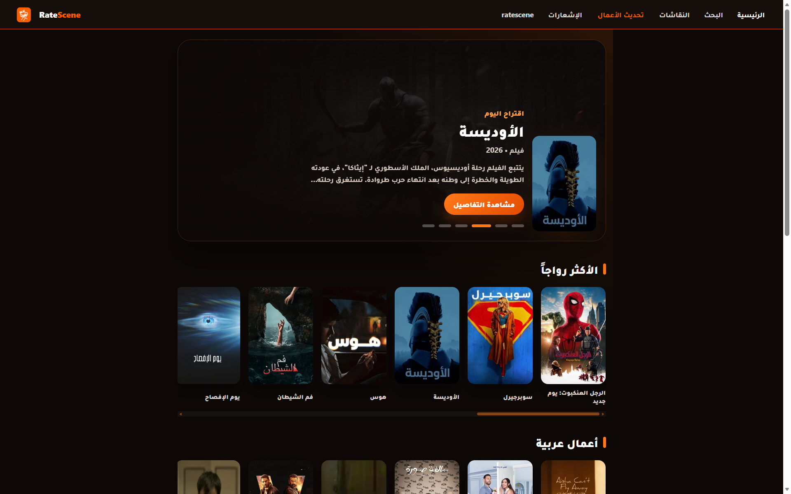
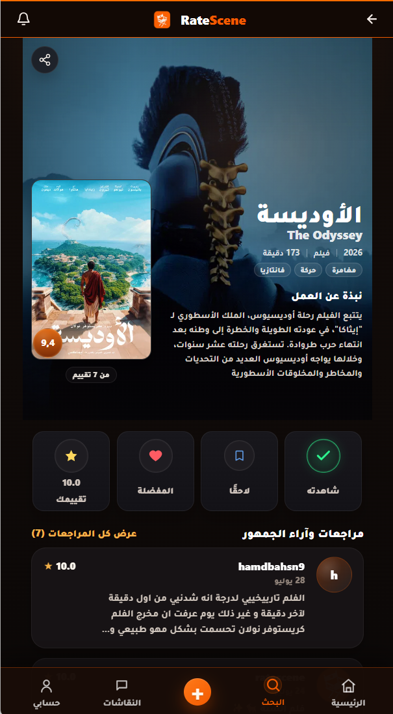
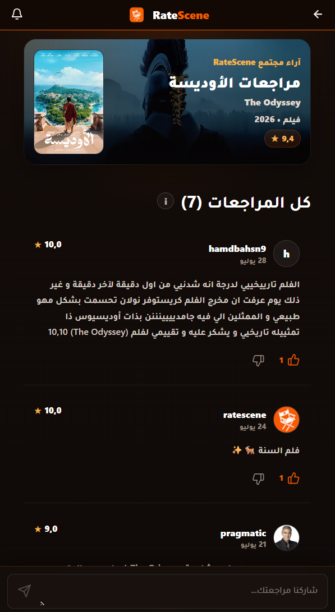
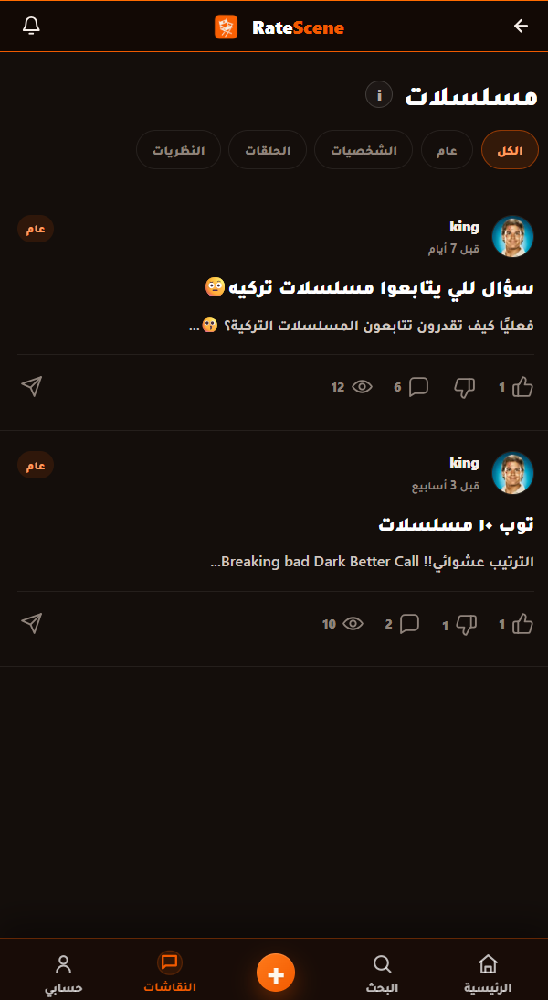
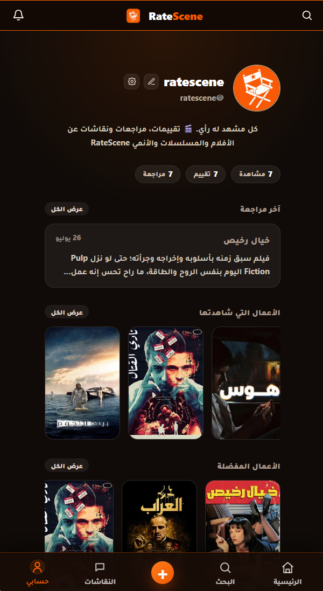
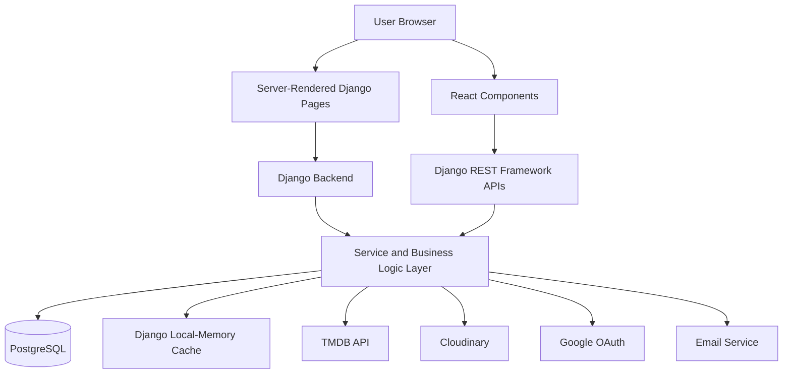
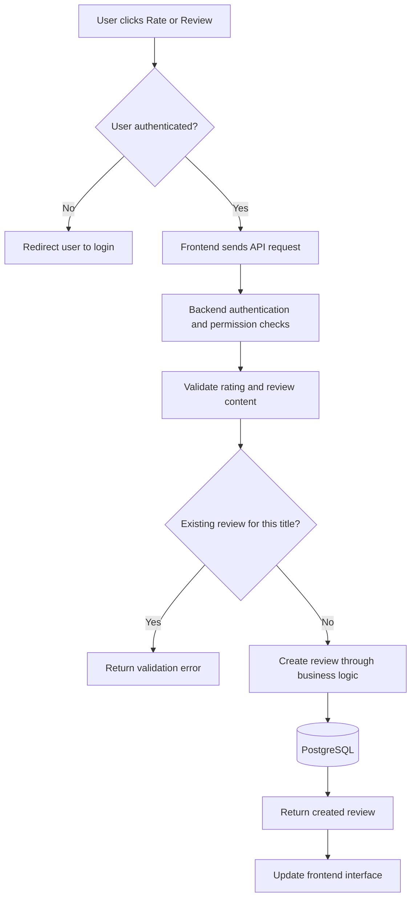
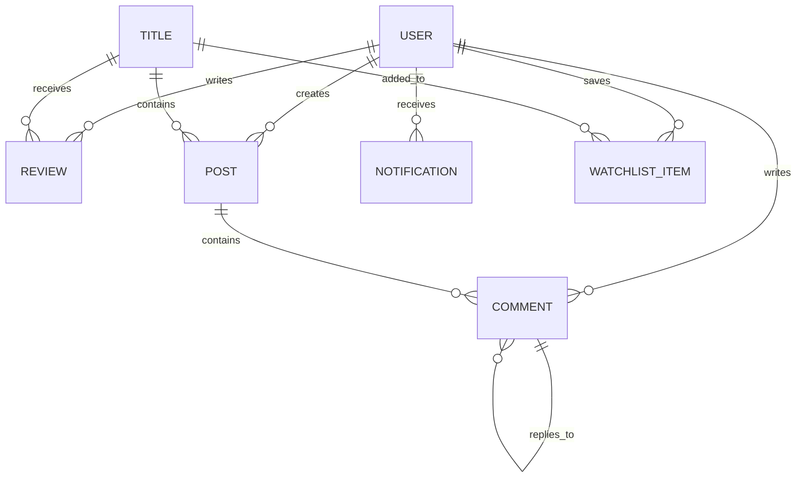
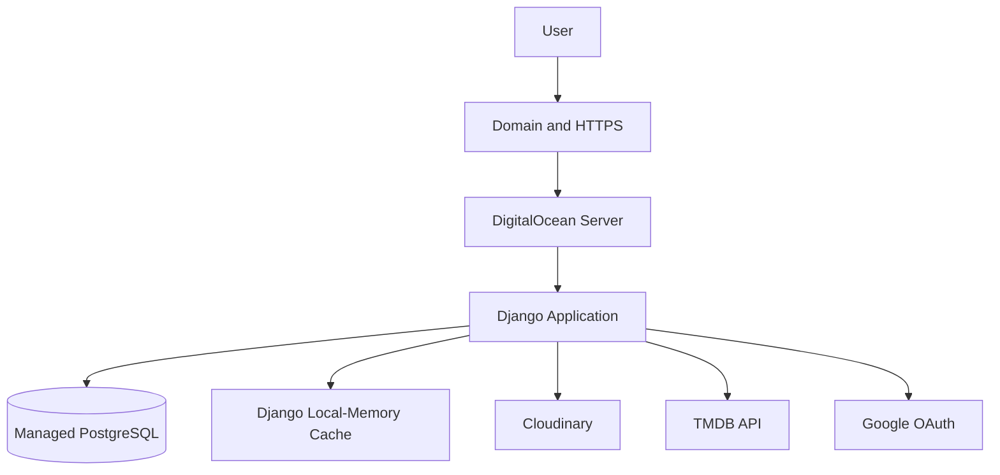

# RateScene

> An Arabic community platform for rating, reviewing, and discussing movies, TV shows, and anime.

<p align="center">
  
</p>

<p align="center">
  <a href="https://ratescene.app">Live Platform</a>
  ·
  <a href="https://youtube.com/shorts/KySbP3yHHRw?feature=share">Project Demo</a>
</p>

---

## Technical Snapshot

- **Backend:** Python, Django, Django REST Framework
- **Frontend:** React, Vite, Django Templates
- **Database:** PostgreSQL with Django ORM
- **Architecture:** Hybrid SSR/SPA, REST APIs, and a service layer for business logic
- **Quality:** 400+ automated tests and continuous integration with GitHub Actions
- **Deployment:** DigitalOcean, Managed PostgreSQL, WhiteNoise, and Cloudinary

---

## Overview

RateScene is an Arabic community platform where users can discover, rate, review, and discuss movies, TV shows, and anime.

The platform combines structured ratings and reviews with dedicated community spaces for each title, allowing Arabic-speaking users to share opinions, participate in discussions, and manage their collections in one place.

I designed and developed RateScene end to end as a production full-stack project, with a strong focus on backend architecture, business logic, SEO, performance, and user experience.

---

## Live Project

- **Live Platform:** [ratescene.app](https://ratescene.app)
- **Current Status:** Live and actively developed

The complete application is available through the live production website.

This repository is intended as a public technical showcase. The production source code and environment configuration are maintained in a separate private repository; therefore, local installation instructions are not included.

---

## Core Features

- Email and password authentication
- Google OAuth login
- Movie, TV show, and anime discovery
- Ratings and written reviews
- One review per user for each title
- Review likes and dislikes
- Dedicated discussion spaces for individual titles
- General movie, TV, and anime communities
- Posts, comments, and nested replies
- User notifications
- Personal collections, including Watchlist, Favorites, and Watched
- User profiles and account management
- Search and recommendations
- SEO-optimized title and review pages
- Responsive and installable PWA experience

---

## Platform Screenshots

### Home Page


### Title Details



### Ratings and Reviews



### Community Discussions



### User Profile



---

## Engineering Highlights

- Hybrid server-rendered and client-rendered architecture, using Django for SEO-sensitive content and React for interactive experiences
- REST API design with Django REST Framework
- Service-layer business logic to keep application rules reusable and separate from presentation concerns
- Relational data modeling with PostgreSQL and Django ORM
- Authentication, ownership checks, permissions, validation, throttling, and production security configuration
- 400+ automated tests covering critical application behavior, with continuous integration through GitHub Actions
- Production deployment with DigitalOcean, Managed PostgreSQL, Cloudinary, WhiteNoise, HTTPS, and a custom domain
- External integrations with TMDB, Google OAuth, analytics, media storage, and email services

---

## Technology Stack

### Backend

- Python
- Django
- Django REST Framework
- PostgreSQL
- Django ORM
- Django Local-Memory Cache

### Frontend

- React
- Vite
- JavaScript
- HTML
- CSS
- Django Templates

### External Services

- TMDB API
- Cloudinary
- Google OAuth
- Google Analytics
- Email services

### Infrastructure and Deployment

- DigitalOcean
- Managed PostgreSQL
- WhiteNoise
- GitHub Actions
- Custom domain and HTTPS

---

## System Architecture

RateScene uses a hybrid frontend architecture that combines server-rendered Django pages with React-powered interactive features.

- Django renders SEO-sensitive and content-focused pages.
- React handles dynamic and interactive user interface components.
- Django REST Framework exposes API endpoints to the frontend.
- The service layer contains reusable business logic.
- PostgreSQL stores relational application data.
- Django's local-memory cache reduces repeated database and external API requests.
- External integrations provide media data, authentication, analytics, and image storage.



For a more detailed explanation, see the [System Architecture Documentation](docs/architecture.md).

---

## Backend Structure

The backend is divided into domain-specific Django applications:

```text
backend/
├── accounts/
├── titles/
├── reviews/
├── interactions/
├── discussions/
├── notifications/
└── config/
```

### Application Responsibilities

| Application | Responsibility |
|---|---|
| `accounts` | Authentication, user profiles, Google login, and account management |
| `titles` | Movie, TV show, and anime data, search, details, and recommendations |
| `reviews` | Ratings, written reviews, and title-related user collections, including Watchlist, Favorites, and Watched |
| `interactions` | Reusable engagement features, including likes and dislikes for reviews, posts, and comments, as well as post view tracking |
| `discussions` | Community spaces, posts, comments, and replies |
| `notifications` | User activity and interaction notifications |
| `config` | Project configuration, URLs, settings, and deployment configuration |

---

## Business Logic

RateScene includes application-specific rules designed to maintain data integrity and provide a consistent user experience.

Examples include:

- A user can submit only one review for each title.
- A rating is required when creating a review.
- Users can edit or delete only their own content.
- Authentication is required for protected operations.
- Notifications are created for relevant comments, replies, likes, and dislikes.
- Users do not receive notifications for their own actions.
- Account deletion requires additional identity confirmation.
- API requests are validated and protected with permissions and throttling.

Detailed feature flows are documented in [Feature Flows](docs/feature-flows.md).

---

## Example Review Request Flow



---

## Data Model Overview

The platform uses relational data models to connect users, titles, reviews, discussions, comments, notifications, and collection entries.



The diagram is intentionally simplified and focuses on the main relationships rather than every internal field.

More information is available in the [Data Model Documentation](docs/data-model.md).

---

## Security and Validation

The project includes several security and validation measures:

- Authentication and permission checks
- Content ownership validation
- Server-side input validation
- Environment variables for sensitive credentials
- API throttling
- CSRF and CORS configuration
- Secure production cookies
- HTTPS
- Custom `403`, `404`, and `500` error pages
- Secrets excluded from version control

Additional details are available in [Security and Deployment](docs/security-and-deployment.md).

---

## Testing and Continuous Integration

RateScene includes **400+ automated tests** covering critical backend and frontend behavior.

GitHub Actions runs the configured test and build checks whenever updates are pushed to the production repository, helping identify regressions before deployment.

Coverage includes:

- Authentication
- Permissions
- Review rules
- Discussion functionality
- Notification behavior
- API validation
- Frontend build checks

---

## Deployment

The production platform is deployed using the following structure:



- The application is hosted on DigitalOcean.
- PostgreSQL is used as the production relational database.
- Django's local-memory cache reduces repeated database and external API requests.
- WhiteNoise handles static assets.
- Cloudinary handles uploaded media.
- HTTPS protects communication between users and the platform.

---

## Technical Documentation

- [System Architecture](docs/architecture.md)
- [Feature Request Flows](docs/feature-flows.md)
- [Data Model](docs/data-model.md)
- [Security and Deployment](docs/security-and-deployment.md)

---

## Roadmap

- [ ] Expand automated test coverage
- [ ] Improve mobile performance and Core Web Vitals
- [ ] Develop more personalized recommendations
- [ ] Expand moderation and community management tools
- [ ] Improve platform analytics and user insights
- [ ] Continue enhancing the PWA experience

---

## Repository Purpose

This repository is a public technical showcase for RateScene. It highlights the platform's functionality, engineering architecture, business rules, testing approach, security practices, and deployment structure while keeping the complete production source code and sensitive environment configuration private.

---

## Author

Developed by **Ahmed Ali Al-Dhaifi**

- [LinkedIn](https://www.linkedin.com/in/ahmed-al-dhaifi/)
- [GitHub](https://github.com/dnjor)
- [Live Platform](https://ratescene.app)

---

## Disclaimer

This project uses data and images provided through the TMDB API.

RateScene is not endorsed or certified by TMDB.