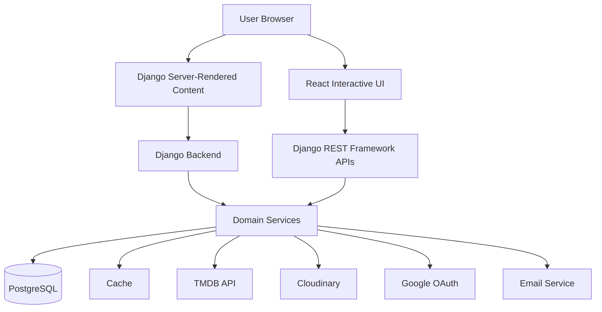
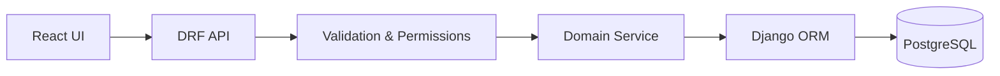

# RateScene — System Architecture

RateScene is a production Django application with a hybrid frontend architecture: **server-rendered content where discoverability matters, and React for interactive user experiences**.

This document focuses on how the system is structured, why key architectural decisions were made, and how the architecture has evolved in response to real development and production requirements.

## 1. Architecture at a Glance



At a high level:

- **Django SSR** serves content where server rendering benefits SEO and discoverability.
- **React** powers interactive parts of the user experience.
- **Django REST Framework** exposes APIs used by interactive frontend features.
- **Domain services** contain reusable application and business logic.
- **PostgreSQL** provides relational persistence.
- **Caching** reduces unnecessary repeated work and external requests.
- External integrations provide entertainment metadata, media storage, authentication, and email delivery.

---

## 2. Domain Boundaries

The backend is divided into Django applications based on product responsibility.

| Domain | Responsibility |
|---|---|
| `accounts` | Authentication, identity, profiles, and account management |
| `titles` | Movie, TV, and anime metadata, discovery, and TMDB integration |
| `reviews` | Ratings, reviews, favorites, watchlist, and watched state |
| `discussions` | Community spaces, posts, comments, and conversation threads |
| `interaction` | Reusable reactions and content-view behavior |
| `notification` | Notifications generated by activity across the platform |
| `config` | Project configuration, routing, middleware, and deployment settings |

These boundaries separate **what a piece of content is** from **what users do with it**.

For example, `titles` owns information about a movie or series, while `reviews` owns a user's rating, written review, and title-related collection state. Reactions that can apply across multiple content types are handled by the shared `interaction` domain instead.

---

## 3. Representative Project Structure

The complete repository contains additional files, but the following simplified structure demonstrates how backend responsibilities are organized:

```text
backend/
│
├── accounts/
│
├── titles/
│   ├── api_views.py
│   ├── serializers.py
│   ├── models.py
│   └── services/
│       ├── tmdb_client.py
│       ├── tmdb_sync.py
│       ├── tmdb_discover.py
│       ├── tmdb_formatters.py
│       ├── title_create.py
│       ├── title_enrichment.py
│       └── homepage.py
│
├── reviews/
│   ├── api_views.py
│   ├── serializers.py
│   ├── models.py
│   └── services/
│       ├── rating.py
│       ├── review.py
│       └── user_state.py
│
├── discussions/
│   └── services/
│       ├── post.py
│       ├── comment.py
│       └── thread.py
│
├── interaction/
│   └── services/
│       ├── reaction.py
│       └── post_view.py
│
├── notification/
│
└── config/
```

Service packages are organized by responsibility so that related logic can be located without navigating a single large service module.

---

## 4. Request Lifecycle

Interactive features generally follow this path:



The frontend is responsible for the user interaction, while important product rules remain enforced on the server.

### Example: Creating a Review

```text
User submits review
        ↓
API receives request
        ↓
Authentication & input validation
        ↓
Review service
        ↓
Business rules
        ↓
Django ORM
        ↓
PostgreSQL
        ↓
Response returned to UI
```

One example is the rule that a user must already have a rating before submitting a written review. This rule is enforced by the review service rather than relying on the frontend.

---

## 5. Key Architecture Decisions

### 5.1 Hybrid Django SSR + React

#### Problem

RateScene originally used Django server-side rendering.

During early development, the frontend moved toward React because interactive functionality was easier to build and provided a more responsive user experience.

After deploying the application, a new problem became visible: important content pages were not being indexed and discovered by search engines as effectively as required.

#### Decision

Instead of reverting entirely to Django templates or continuing with a fully client-rendered frontend, RateScene adopted a hybrid strategy:

```text
Content / SEO-sensitive experiences
              ↓
         Django SSR

Interactive experiences
              ↓
            React
              ↓
          REST APIs
```

The routing structure reflects this approach, with traditional Django routes existing alongside dedicated API routes.

#### Why

The architecture allows RateScene to use server rendering where discoverability matters while retaining React where client-side interaction provides meaningful value.

#### Trade-off

A hybrid frontend introduces more complexity than maintaining a single rendering strategy.

That complexity is accepted because the two approaches solve different product requirements.

---

### 5.2 Service Layer and Service Packages

#### Problem

Earlier parts of RateScene placed more application logic directly inside API views.

As features grew, modifying those flows became harder because HTTP handling, queries, and business rules were increasingly mixed together.

The first improvement was extracting logic into a `service.py` file for each domain.

That worked until some service modules themselves grew large, making it increasingly time-consuming to locate related functions and understand which functions depended on others.

#### Decision

Larger service modules were reorganized into packages based on responsibility:

```text
Business logic in API views
            ↓
        service.py
            ↓
services/
├── responsibility_a.py
├── responsibility_b.py
└── responsibility_c.py
```

For example, TMDB communication, formatting, synchronization, discovery, and title enrichment can evolve independently rather than living inside one large service module.

#### Why

This structure makes the location of application logic more predictable and has reduced the time required to:

- Identify where a problem originates
- Debug feature behavior
- Modify existing functionality
- Understand dependencies
- Revisit earlier implementation decisions

The current review services, for example, contain review-specific rules and retrieval logic outside the API presentation layer.

#### Trade-off

More focused service modules mean more files and an additional level of navigation.

For RateScene, that indirection became preferable to maintaining large service modules with many unrelated functions.

Some older API flows still reflect earlier patterns and are being refactored incrementally rather than through a risky full rewrite.

---

### 5.3 Generic Interaction System

#### Problem

Likes and dislikes are not unique to one RateScene feature.

Reviews, posts, comments, and other supported content can require similar reaction behavior.

Creating a dedicated reaction implementation for every content type would lead to duplicated models and business logic:

```text
Review  ──→ ReviewReaction
Post    ──→ PostReaction
Comment ──→ CommentReaction
...
```

#### Decision

RateScene instead has a shared `interaction` domain.

```text
Review ───────┐
Post ─────────┤
Comment ──────┼──→ Reaction
ThreadMessage ┘
                    │
                    ├── ContentType
                    ├── Object ID
                    └── Reaction Value
```

Django ContentTypes provide the mechanism for a reaction to reference different supported object types.

The implementation does not allow arbitrary models to become reaction targets. Supported targets are explicitly controlled by application logic.

#### Why

The goal was to implement interaction behavior once instead of recreating essentially the same reaction system every time another type of content needed it.

It also provides one place for shared reaction behavior to evolve.

#### Trade-off

Generic relationships introduce more indirection than explicit foreign keys.

RateScene accepts that complexity in exchange for reduced duplication and reusable behavior, while using controlled target validation to limit what the generic relationship can reference.

---

### 5.4 Caching: Current Need vs. Future Scale

#### Problem

Redis provides advantages as a shared external cache, but running additional infrastructure also introduces operational cost.

At RateScene's current production traffic level, that additional cost is not yet justified by request volume.

#### Decision

The caching configuration supports both strategies:

```text
Django Cache Interface
        │
        ├── REDIS_URL configured
        │         ↓
        │       Redis
        │
        └── No REDIS_URL
                  ↓
              LocMemCache
```

The current production environment uses local-memory caching.

Redis support remains available through configuration for a future point where traffic or deployment requirements justify a shared cache.

#### Why

This avoids paying for infrastructure before the application benefits from it while keeping a straightforward migration path when requirements change.

#### Trade-off

Local-memory caching is process-local and does not provide the shared-cache characteristics Redis would provide across multiple application processes or instances.

That limitation is acceptable at the application's current scale but would need to be reconsidered as deployment topology or traffic grows.

---

## 6. Cross-Domain Communication

Separating domains does not mean they operate independently.

Reactions and notifications provide one example:

```text
User reacts to content
        ↓
Interaction Service
        ↓
Reaction persisted
        ↓
Transaction succeeds
        ↓
Notification Service
        ↓
Notification created
```

The interaction service schedules notification creation using `transaction.on_commit()`, so notification work follows successful persistence of the relevant interaction.

The responsibilities remain separate:

**Interaction owns the action.**  
**Notification owns the resulting notification.**

This allows notification behavior to remain independent of the implementation details of the originating feature.

---

## 7. External Services and Data Flow

### TMDB

TMDB is the primary external source for movie, TV, and anime metadata.

Rather than spreading TMDB logic throughout views and models, the `titles` domain separates external-data responsibilities into focused services.

```text
TMDB API
   ↓
TMDB Client
   ↓
Discovery / Synchronization / Formatting / Enrichment
   ↓
Local Title Data
   ↓
Application APIs & UI
```

This keeps external API concerns separate from the rest of the application's title behavior.

Other production integrations include:

- **Cloudinary** for uploaded media
- **Google OAuth** for third-party authentication
- **Email services** for transactional email

Sensitive configuration is supplied through environment variables rather than stored directly in source code.

---

## 8. Current Limitations and Next Architectural Steps

RateScene is a production project that continues to evolve. The current architecture intentionally includes areas that can be improved as requirements change.

### Incremental Service-Layer Migration

Some older flows still contain more application logic in API views than newer parts of the codebase.

Rather than rewriting stable functionality solely for architectural consistency, these areas are being moved toward the newer service pattern as they are modified.

### API Response Consistency

Newer API flows follow more structured response patterns than some earlier endpoints.

Standardizing those contracts further would simplify frontend integration and make API behavior more predictable across domains.

### Shared Caching

LocMemCache currently matches the application's production requirements.

Moving to Redis becomes worthwhile when traffic, multiple application instances, or shared-cache requirements make process-local caching insufficient.

### Frontend Evolution

The hybrid frontend will continue to be evaluated feature by feature.

The goal is not to migrate every page to React or every interface back to server rendering. Each rendering approach should continue to be used where its characteristics best match the product requirement.

---

## 9. Engineering Principles

The current architecture reflects four practical principles:

1. **Architecture should solve product problems, not create complexity for appearance.**
2. **Business rules should remain enforceable independently of the frontend.**
3. **Repeated behavior should become shared infrastructure only when it is genuinely reusable.**
4. **Infrastructure and architectural complexity should grow when requirements justify them.**

RateScene's architecture has therefore evolved incrementally: from Django SSR to React and then hybrid rendering, from API-heavy business logic to focused service packages, and from feature-specific interaction requirements to a reusable interaction domain.

The architecture is expected to continue evolving as the product, traffic, and engineering requirements change.
