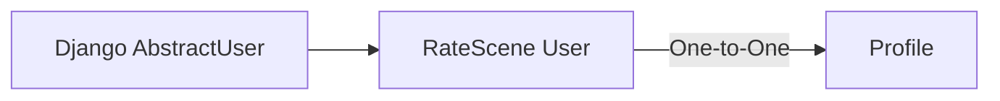
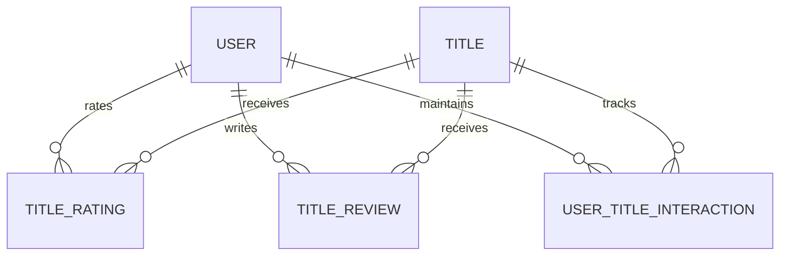

# RateScene — Data Model

This document focuses on the most important data relationships and database design decisions in RateScene. It is intentionally selective rather than a complete reference for every model, field, or internal implementation detail.

The goal is to highlight the relationships that best explain how the platform's core data is structured and how important integrity rules are enforced.

---

## 1. User & Profile

RateScene uses a custom `User` model built on Django's `AbstractUser` for authentication and account identity.

Profile-specific information is stored separately in a `Profile` model connected to the user through a one-to-one relationship.



The `User` model owns account identity such as username and email, while the `Profile` model stores user-facing profile data such as display name, biography, and avatar.

```python
class Profile(models.Model):
    user = models.OneToOneField(
        settings.AUTH_USER_MODEL,
        on_delete=models.CASCADE,
        related_name="profile",
    )
```

Keeping these responsibilities separate avoids mixing authentication data with profile presentation data.

Because the relationship uses `on_delete=models.CASCADE`, removing a user also removes the associated profile.

---

## 2. User & Title Ecosystem

A `Title` is the central content entity used for movies and TV shows.

Users interact with titles through dedicated relationship models rather than through a single generic user-title record.

### Relationship Overview



This means the platform supports many users interacting with many titles, while each relationship type has its own responsibility.

- `TitleRating` stores the user's score for a title.
- `TitleReview` stores the user's written review.
- `UserTitleInteraction` stores personal title state such as favorite and watch status.

### One Record per User and Title

Each relationship model allows only one record for the same user/title pair.

For example, a user cannot have two separate rating records for the same title:

```python
models.UniqueConstraint(
    fields=["user", "title"],
    name="unique_user_title_rating",
)
```

Equivalent constraints are used for reviews and user-title interactions.

```text
User + Title
│
├── One Rating
├── One Review
└── One UserTitleInteraction
```

This allows many users to interact with the same title while preventing duplicate state for the same user.

### Title Identity

Titles imported from TMDB are uniquely identified using both the external TMDB identifier and media type:

```python
models.UniqueConstraint(
    fields=["tmdb_id", "media_type"],
    name="unique_tmdb_title",
)
```

This prevents duplicate local title records for the same external media entity.

### Rating Implies Watched

Rating a title also updates the user's personal title state.

The rating and watched-state update are performed together:

```text
User rates Title
      ↓
Create or Update Rating
      ↓
Mark Title as WATCHED
```

The service performs both operations inside a database transaction:

```python
@transaction.atomic
def save_rating_and_mark_watched(*, user, title, score):
    rating, created = create_or_update_rating(
        user=user,
        title=title,
        score=score,
    )

    interaction, _ = update_user_title_interaction(
        user=user,
        title=title,
        data={
            "watch_status":
            UserTitleInteraction.WatchStatus.WATCHED
        },
    )
```

Once a title has been rated, its watch status cannot be changed back to a non-watched state.

This keeps the user's rating and viewing state logically consistent.

### Account Deletion Behavior

Different user-title relationships have different lifecycle rules when an account is deleted.

```text
User deleted
│
├── UserTitleInteraction → removed
├── TitleRating          → preserved, user = NULL
└── TitleReview          → preserved, user = NULL
```

Personal state such as favorites and watch status is tied directly to the user's account and is removed with it.

Ratings and reviews are treated as historical contributions to the title and remain available after account deletion, while their relationship to the deleted user is removed.

The models implement this difference through their deletion behavior:

```python
# Personal user-title state
user = models.ForeignKey(
    User,
    on_delete=models.CASCADE,
)

# Rating / Review
user = models.ForeignKey(
    User,
    on_delete=models.SET_NULL,
    null=True,
    blank=True,
)
```

This preserves the title's historical rating and review data without retaining the deleted account relationship.

### Engineering Principle

The user-title model separates different kinds of state instead of combining them into one large relationship.

Ratings, reviews, and personal collection state each have their own lifecycle and integrity rules, while database constraints keep each user/title relationship unique and consistent.
