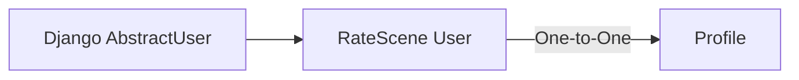

# RateScene — Data Model

This document focuses on the most important data relationships and database design decisions in RateScene. It is intentionally selective rather than a complete reference for every model, field, or internal implementation detail.

The goal is to highlight the relationships that best explain how the platform's core data is structured and how important integrity rules are enforced.

---

## 1. User & Profile

RateScene uses a custom `User` model built on Django's `AbstractUser` for authentication and account identity.

Profile-specific information is stored separately in a `Profile` model connected to the user through a one-to-one relationship.



The `User` model owns account identity such as username and email, while the `Profile` model stores user-facing profile data such as display name, biography, and avatar.

```python
class Profile(models.Model):
    user = models.OneToOneField(
        settings.AUTH_USER_MODEL,
        on_delete=models.CASCADE,
        related_name="profile",
    )
```

Keeping these responsibilities separate avoids mixing authentication data with profile presentation data.

Because the relationship uses `on_delete=models.CASCADE`, removing a user also removes the associated profile.
