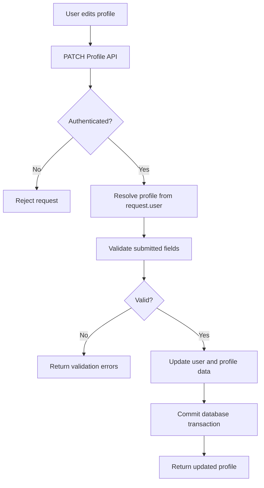
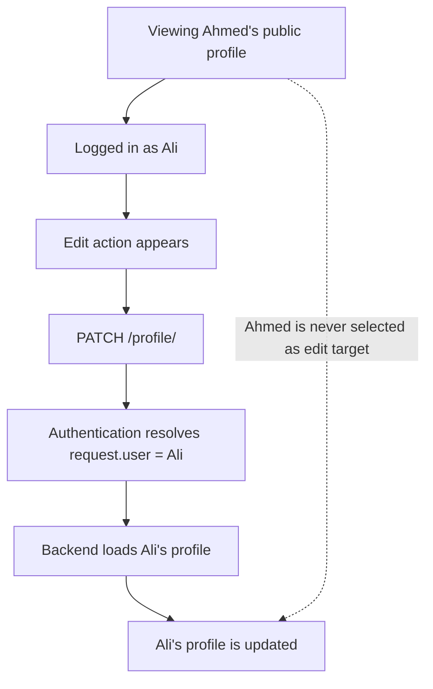

# RateScene — Feature Flows

This document explains selected RateScene feature flows and the backend decisions behind them.

---

## 1. Profile Update & Ownership Protection

Profile updates are treated as an authenticated user operation. The backend resolves the profile from the authenticated request identity rather than accepting a separate target user identifier from the client.

### Request Flow



### Server-Side Ownership

The profile update endpoint is restricted to authenticated users. The profile being modified is selected from `request.user`, so the client does not choose which account is updated.

```python
class ProfileAPIView(BaseAccountAPIView):
    permission_classes = [IsAuthenticated]

    def patch(self, request):
        profile = services_profile.get_or_create_profile(
            user=request.user
        )
```

This keeps profile ownership enforcement on the server and independent from what the frontend displays.

> **Note — Why another profile cannot be edited**
>
> Authentication resolves the current session or token to a specific user and exposes that identity as `request.user`. The private profile endpoint then loads the editable profile from that identity only; it does not accept a target username or user ID from the client.
>
> RateScene also separates public profile lookup from private profile editing: a public profile may be viewed by username, while `/profile/` represents the authenticated user's own profile flow.
>
> Therefore, even if the frontend mistakenly shows an Edit action while another user's public profile is being viewed, the edit request still resolves and updates the authenticated user's own profile — not the profile currently on screen.



### Validation Before Persistence

Submitted profile data is validated before saving. Current checks include username format and uniqueness, display-name and biography length limits, avatar handling, and support for partial updates.

### Avatar Handling

Uploaded avatars are checked against a configured size limit before image processing. Accepted images are normalized to a predictable format and resized while preserving their aspect ratio.

### Atomic Profile Updates

Changes that involve both account and profile data are performed inside a database transaction. When an avatar is replaced, removal of the previous file is scheduled only after the database transaction successfully commits.

### Engineering Principle

**The frontend controls the interface. The backend controls authorization.**

Profile ownership is derived from the authenticated server-side request identity rather than from a client-selected user identifier.
