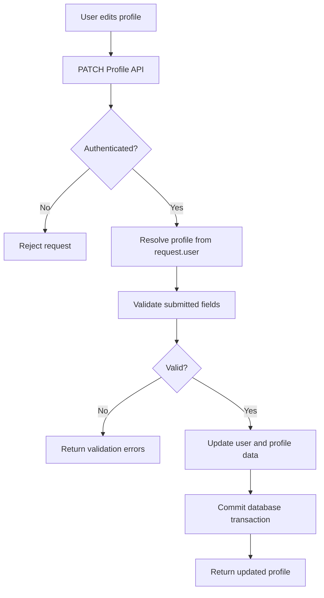
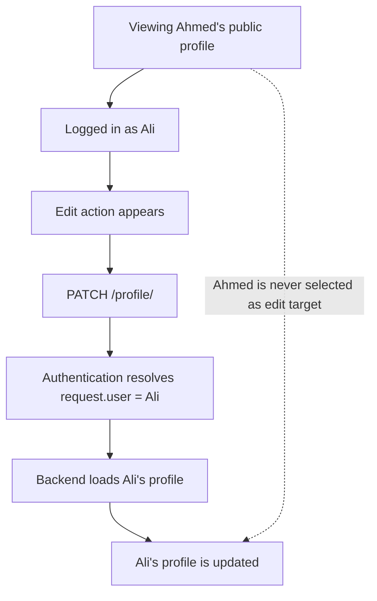
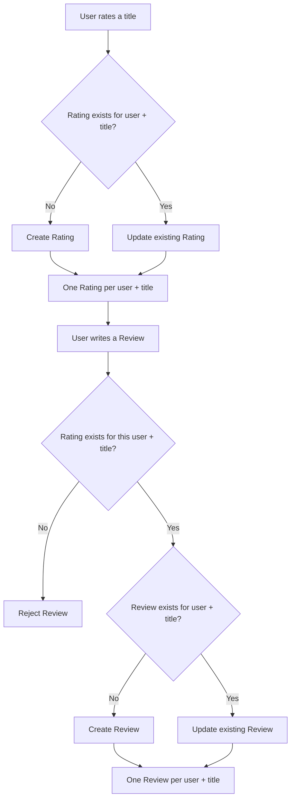

# RateScene — Feature Flows

This document explains selected RateScene feature flows and the backend decisions behind them.

---

## 1. Profile Update & Ownership Protection

Profile updates are treated as an authenticated user operation. The backend resolves the profile from the authenticated request identity rather than accepting a separate target user identifier from the client.

### Request Flow



### Server-Side Ownership

The profile update endpoint is restricted to authenticated users. The profile being modified is selected from `request.user`, so the client does not choose which account is updated.

```python
class ProfileAPIView(BaseAccountAPIView):
    permission_classes = [IsAuthenticated]

    def patch(self, request):
        profile = services_profile.get_or_create_profile(
            user=request.user
        )
```

This keeps profile ownership enforcement on the server and independent from what the frontend displays.

> **Note — Why another profile cannot be edited**
>
> Authentication resolves the current session or token to a specific user and exposes that identity as `request.user`. The private profile endpoint then loads the editable profile from that identity only; it does not accept a target username or user ID from the client.
>
> RateScene also separates public profile lookup from private profile editing: a public profile may be viewed by username, while `/profile/` represents the authenticated user's own profile flow.
>
> Therefore, even if the frontend mistakenly shows an Edit action while another user's public profile is being viewed, the edit request still resolves and updates the authenticated user's own profile — not the profile currently on screen.



### Validation Before Persistence

Submitted profile data is validated before saving. Current checks include username format and uniqueness, display-name and biography length limits, avatar handling, and support for partial updates.

### Avatar Handling

Uploaded avatars are checked against a configured size limit before image processing. Accepted images are normalized to a predictable format and resized while preserving their aspect ratio.

### Atomic Profile Updates

Changes that involve both account and profile data are performed inside a database transaction. When an avatar is replaced, removal of the previous file is scheduled only after the database transaction successfully commits.

### Engineering Principle

**The frontend controls the interface. The backend controls authorization.**

Profile ownership is derived from the authenticated server-side request identity rather than from a client-selected user identifier.

---

## 2. Rating & Review — Unique User/Title Records

RateScene treats both ratings and written reviews as unique records for a specific user and title. Re-submitting either action updates the existing record instead of creating duplicates.

A written review has one additional business rule: the user must rate the title before a review can be created.

### Request Flow



### Rating — Create Once, Then Update

The rating service uses `update_or_create()` with the authenticated user and title as the lookup pair:

```python
rating, created = TitleRating.objects.update_or_create(
    user=user,
    title=title,
    defaults={"score": score},
)
```

The first rating creates the record. Rating the same title again updates that same user/title record rather than creating another one.

The database reinforces this rule with a unique constraint:

```python
models.UniqueConstraint(
    fields=["user", "title"],
    name="unique_user_title_rating",
)
```

### Review — Rating Required First

Before creating or updating a written review, the service verifies that the same user already has a rating for the same title:

```python
if not user_has_rating_for_title(user=user, title=title):
    raise ValueError("التقييم مطلوب قبل المراجعة.")
```

This rule is enforced on the backend, so the frontend may guide the user through the intended sequence, but it cannot bypass the requirement with a manually constructed request.

Once the requirement is satisfied, the review follows the same create-or-update pattern:

```python
return TitleReview.objects.update_or_create(
    user=user,
    title=title,
    defaults={"body": body},
)
```

The database also guarantees one review per user/title pair:

```python
models.UniqueConstraint(
    fields=["user", "title"],
    name="unique_user_title_review",
)
```

### Response-Ready Review Data

A review response contains more than the review body. The response serializer exposes the review details together with the author's rating, author/profile information, title context, and reaction state.

```text
Review
├── id, body, user_rating, timestamps
Author
├── username, display_name, profile_image
Title
├── tmdb_id, media_type, title
Reactions
├── like_count, dislike_count, user_reaction
```

The review queryset is prepared before serialization with related data and annotations:

```python
TitleReview.objects
    .filter(title=title)
    .select_related(
        "user",
        "user__profile",
        "title",
    )
```

The author's rating is attached with a correlated `Subquery`, and reaction data is annotated before the response is serialized. This avoids performing a separate rating lookup for every review item.

### Engineering Principle

**The service layer enforces product rules, while database constraints preserve record integrity.**

RateScene keeps one rating and one review per user/title pair, updates existing records instead of duplicating them, and requires an existing rating before accepting a written review.
