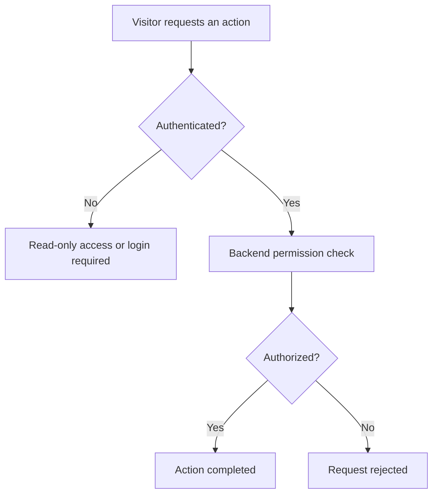

# Security and Deployment

This document summarizes the main security controls used by RateScene. It focuses on the protections applied to the live web platform and intentionally avoids exposing sensitive configuration details.

## Authentication and Authorization

RateScene uses Django session authentication for the web application. It supports email and password login and a custom Google Sign-In integration. Google identity tokens are verified by the backend before the user is authenticated through Django's session system.

Unauthenticated visitors have read-only access. They can browse and search titles, open title pages, and read reviews, discussions, comments, and replies. Interactive actions require an authenticated account.

Authentication is checked in both the frontend and backend. Frontend checks control which actions are shown, while backend checks enforce access rules even when an API is called directly.

### Request Flow

### Access Control

| Capability | Visitor | Authenticated user | Staff |
|---|---:|---:|---:|
| Browse and search titles | Yes | Yes | Yes |
| Read reviews and discussions | Yes | Yes | Yes |
| Create reviews, posts, comments, and replies | No | Yes | Yes |
| Rate titles and manage personal collections | No | Own account only | Own account only |
| Update profile and account information | No | Own account only | Own account only |
| Update a review | No | Own review only | Own review only |
| Manage title information | No | No | Yes |
| Create or delete discussion spaces | No | No | Yes |

Permission checks are enforced on the server. Staff-only operations reject requests from users who do not have the required permission. Ownership-sensitive operations use the authenticated user rather than trusting a user identifier supplied by the client.

> Review deletion and some content-management controls are not currently exposed as completed web features. Unfinished mobile authentication is outside the scope of this document.
