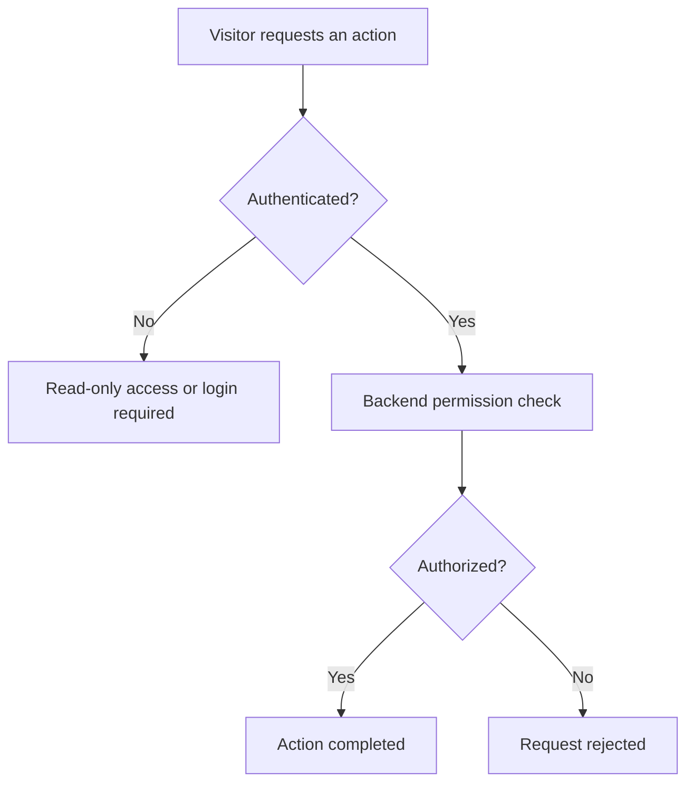
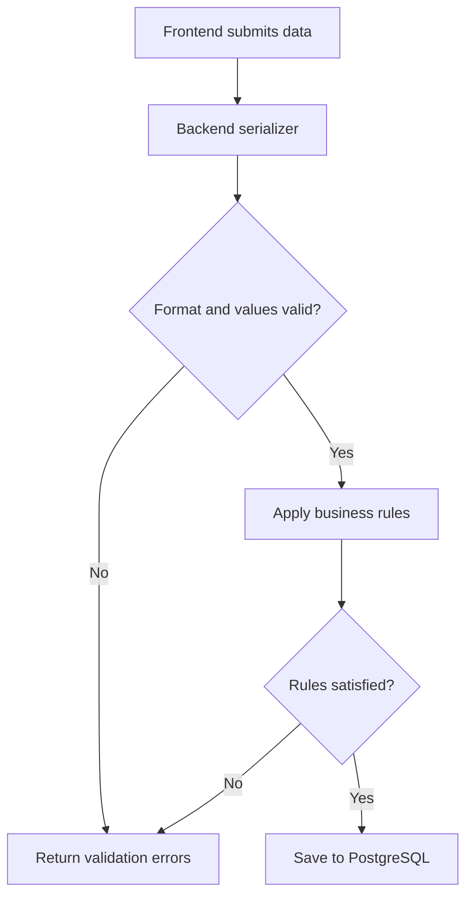
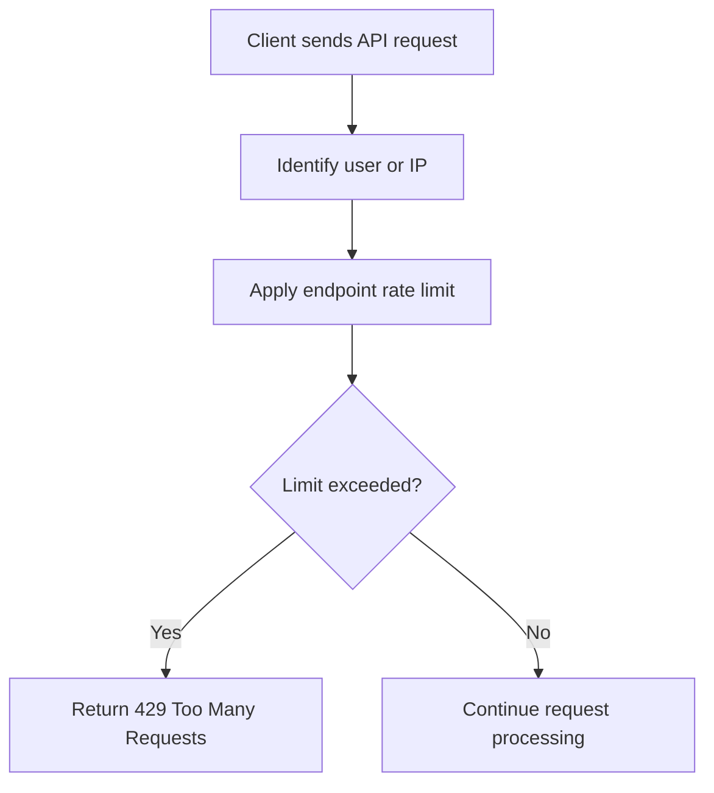
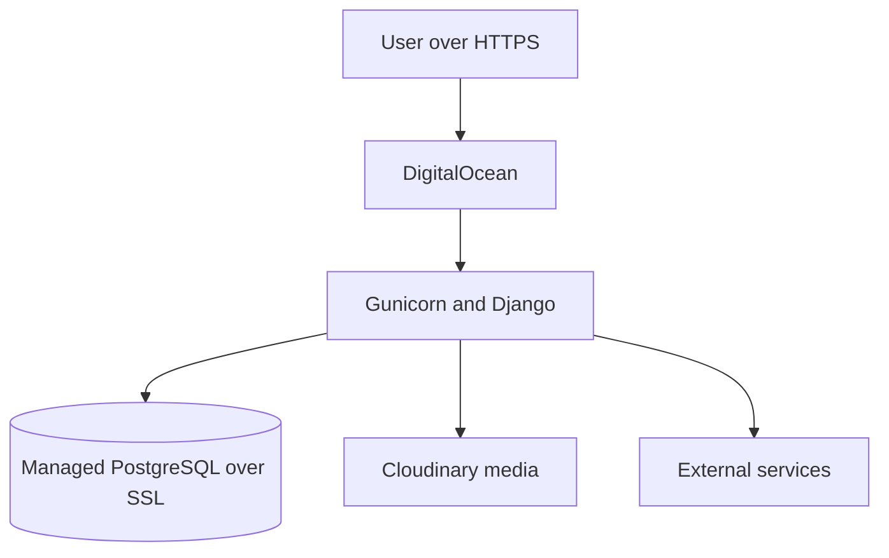

# Security and Deployment

This document summarizes the main security controls used by RateScene. It focuses on the protections applied to the live web platform and intentionally avoids exposing sensitive configuration details.

## Authentication and Authorization

RateScene uses Django session authentication for the web application. It supports email and password login and a custom Google Sign-In integration. Google identity tokens are verified by the backend before the user is authenticated through Django's session system.

Unauthenticated visitors have read-only access. They can browse and search titles, open title pages, and read reviews, discussions, comments, and replies. Interactive actions require an authenticated account.

Authentication is checked in both the frontend and backend. Frontend checks control which actions are shown, while backend checks enforce access rules even when an API is called directly.

### Request Flow

### Access Control

| Capability | Visitor | Authenticated user | Staff |
|---|---:|---:|---:|
| Browse and search titles | Yes | Yes | Yes |
| Read reviews and discussions | Yes | Yes | Yes |
| Create reviews, posts, comments, and replies | No | Yes | Yes |
| Rate titles and manage personal collections | No | Own account only | Own account only |
| Update profile and account information | No | Own account only | Own account only |
| Update a review | No | Own review only | Own review only |
| Manage title information | No | No | Yes |
| Create or delete discussion spaces | No | No | Yes |

Permission checks are enforced on the server. Staff-only operations reject requests from users who do not have the required permission. Ownership-sensitive operations use the authenticated user rather than trusting a user identifier supplied by the client.

> Review deletion and some content-management controls are not currently exposed as completed web features. Unfinished mobile authentication is outside the scope of this document.

## Server-Side Validation

RateScene validates incoming data on the backend before applying business rules or saving changes. Frontend validation provides faster feedback, but backend validation remains the final authority because API requests can be sent directly.

### Validation Flow

### Examples

| Area | Validation |
|---|---|
| Posts | The title is optional and limited to 255 characters. Content is required, cannot contain only whitespace, and is limited to 5,000 characters. Posts in title-specific spaces must include a valid topic type. |
| Ratings | Scores must be numeric, range from 1.0 to 10.0, and use whole or half-point values such as 7.0 or 7.5. Each user can have only one rating per title. |
| Accounts | Email addresses must have a valid format and be unique. Usernames must be valid and unique, and passwords are checked using Django's password-validation rules. Email and username uniqueness checks are case-insensitive. |

Invalid requests are rejected with clear validation errors and are not saved to the database.

## API Throttling

RateScene applies different request limits according to the risk and cost of each operation. General limits reduce excessive resource use, stricter account limits slow automated credential attacks, and content-specific limits reduce spam.

### Throttling Flow

### Protection Levels

| Area | Representative limits | Purpose |
|---|---|---|
| General API access | Anonymous visitors: 300/hour; authenticated users: 2,000/day | Prevent one client from continuously consuming application resources |
| Sensitive account actions | Login: 5/minute; registration: 5/hour; password reset: 3/hour | Slow password guessing and automated account abuse |
| Content and interactions | Posts: 5/minute; comments: 10/minute; reviews: 10/hour; reactions: 30/minute | Reduce automated spam and repeated low-effort submissions |

Review creation has a stricter hourly limit because reviews are intended to contain meaningful opinions rather than rapid repeated submissions. Legitimate users can occasionally reach this limit during unusually high activity; the API responds with `429 Too Many Requests` and allows the operation again after the throttling period expires.

Login responses use a general invalid-credentials message rather than revealing whether a particular email address exists. Repeated failed attempts against the Django admin are also protected by a temporary login lockout.

## Production Security and Deployment

RateScene combines production security settings with managed deployment infrastructure. Environment-specific configuration keeps development convenient while enabling stricter controls in production.

### Production Setup

| Area | Implementation |
|---|---|
| Hosting | The Django application is deployed on DigitalOcean and served with Gunicorn |
| Database | Managed PostgreSQL is used with an SSL-configurable database connection |
| HTTPS | Production settings redirect HTTP requests to HTTPS and enable HSTS |
| Secure cookies | Session and CSRF cookies are transmitted only over HTTPS in production |
| Secret management | Django, database, Google, email, TMDB, and Cloudinary credentials are loaded from environment variables; `.env` files are excluded from version control |
| Request trust | Allowed hosts and trusted CSRF origins are configured through environment variables |
| Static and media files | WhiteNoise serves versioned static assets, while Cloudinary stores uploaded media |
| Continuous integration | GitHub Actions checks Django configuration and migrations, runs backend tests, lints the frontend, and verifies the production frontend build |

### Deployment Flow

Production mode disables Django debug output so internal stack traces and configuration details are not exposed to users. Sensitive values are supplied by the deployment environment rather than committed with the application source.
